*이 저장소에는 kxver 모듈에 대한 서드파티 라이브러리나 소스 코드는 포함되어 있지 않습니다.  
kxver 모듈은 주로 버전 관리에 사용되며, 특히 Ultimate 버전 관련 기능(데이터 암호화 등)에 사용됩니다.  
팀의 유일한 자금원이며, 제품 유지 보수 및 업그레이드를 위한 중요한 보장입니다.  
자금원이 해결될 때까지 이 모듈의 소스 코드를 공개할 계획은 없습니다.*  
***

  
  <h2 style="text-align: center;">크로스 플랫폼 / 저메모리 / 다중 프로토콜 / 다기능 / 클라우드 동기화</h2>
  <h3 style="text-align: center;">[<a href="README.md">English</a>] | [<a href="README-zh_CN.md">简体中文</a>][<a href="README-zh_TW.md">繁體中文</a>][<a href="README-de.md">Deutsch</a>][<a href="README-es.md">Español</a>][<a href="README-fr.md">Français</a>][<a href="README-hi.md">हिंदी</a>][<a href="README-id.md">Bahasa Indonesia</a>][<a href="README-ja.md">日本語</a>][<a href="README-ko.md">한국어</a>][<a href="README-ru.md">Русский</a>]</h3>
  <h3 style="text-align: center;">[<a href="https://woterm.com">WoTerm 공식 웹사이트</a>]</a></h3>

# 개요
주요 원격 통신 프로토콜 통합: SSH1/SSH2, FTP/FTPS, SFTP, TELNET, RLOGIN, RDP, VNC, SHELL, 시리얼 포트, TCP, UDP 등 지원 — 도구 전환 불필요.  
통합 플랫폼에서 다양한 원격 액세스 시나리오를 쉽게 처리.

## 기능 설명
- Windows / Linux / MacOSX / Android 지원.  
- 주요 통신 프로토콜 지원: SSH1 / SSH2 / SFTP / RLOGIN / TELNET / SERIALPORT / VNC / RDP 등.  
- 여러 내장 스킨, 확장 가능, 고급 사용자가 자유롭게 커스터마이징 가능.  
- 관리자 모드: 세션 비밀번호 확인 및 도난 방지.  
- SFTP 기반 클라우드 동기화 프로토콜, 8개 고강도 암호화 알고리즘.  
- SSH 터미널에 내장 SFTP 도우미, 독립 탭도 지원.  
- 플로팅 탭 디자인, 다중 창 협업에 편리.  
- 무제한 창 분할.  
- 세션 그룹 및 키워드 필터.  
- 수십 가지 터미널 색상 선택 가능.

- VNC 원격 데스크톱 지원, 고급 기능은 [WoVNCServer](http://wovnc.com) 필요.  
  - RFB 3.3/3.7/3.8 표준 프로토콜.  
  - 표준 인코딩: ZRLE / TRLE / Hextile / CopyRect / RRE / Raw.  
  - 확장 인코딩: H264 / JPEG / ZRLE3 / TRLE3 / ZRLE2 / TRLE2.  
  - 네트워크 연결 끊김 또는 원격 작업 종료 시 자동 화면 잠금.  
  - 원격 블랙 스크린 모드.  
  - 원격 데스크톱 사운드 재생.  
  - 이미지 품질 전환 가능: 무손실, HD, 일반, 16/15/8비트.  
  - 멀티 스크린 및 스트레치, 공유, 분할 모드 지원.

- 원격 터미널 지원.  
  - Windows/Linux/MacOSX 터미널 액세스.  
  - 프록시 점프 지원.  
  - 인증서 관리.  
  - 단축키 설정.  
  - ZModem 파일 업로드/다운로드.  
  - 내장 SFTP 협업.  
  - 다양한 터미널 색상 선택 가능.

## 모듈 설명
클라이언트 코드는 완전히 오픈소스(kxver 모듈 제외), 서드파티 코드는 GitHub, CodeProject 또는 다른 오픈 커뮤니티 출처. 일부 모듈은 [WoVNC](http://wovnc.com)에서 가져옴.

## WoVNCServer
고급 기능 사용을 위해 [WoVNCServer](http://wovnc.com) 권장.

## 추가 정보:
<a href="http://www.woterm.com">http://www.woterm.com</a>

## 바이너리 다운로드:
<a href="http://woterm.com">http://woterm.com</a>

## UI 미리보기:

메인 UI 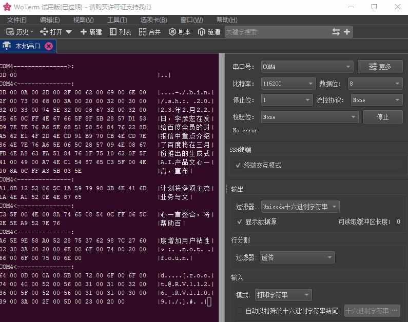

SSH 키 관리 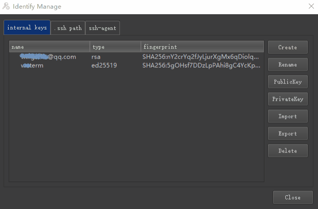

시리얼 포트 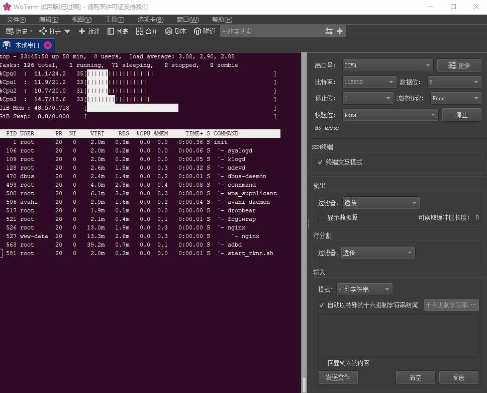

터널 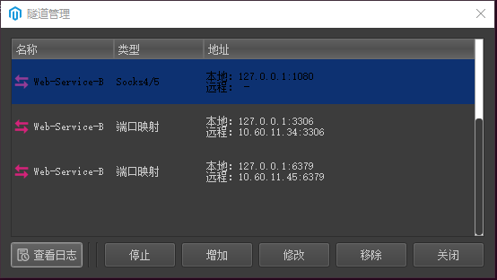

다중 스킨 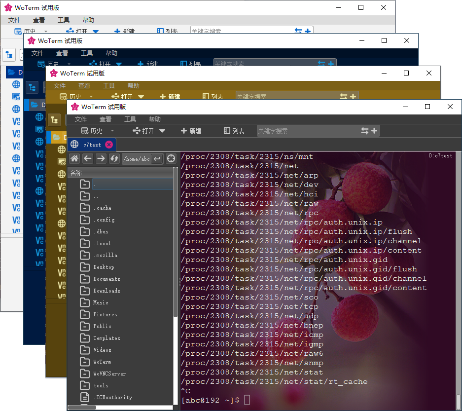

플레이북 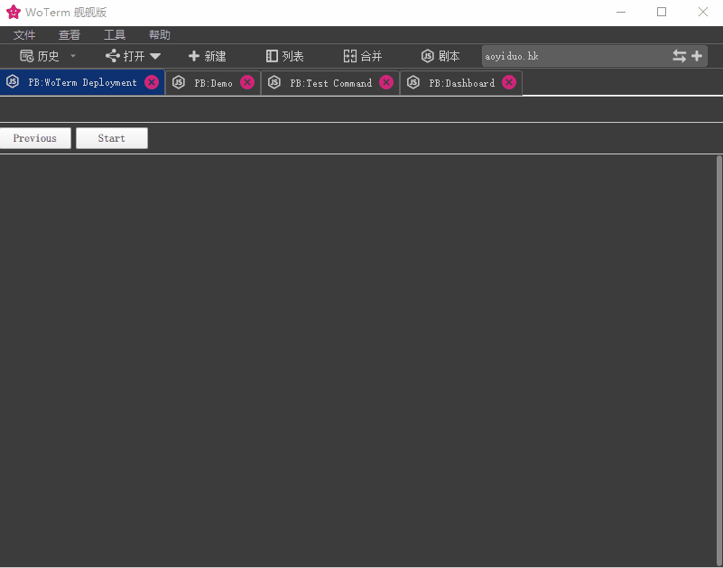

병합 및 분할 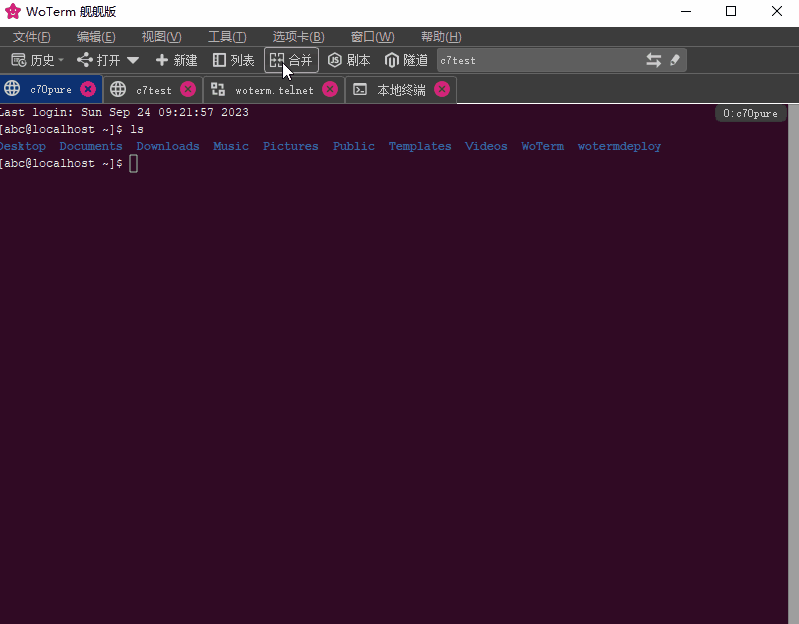

클라우드 동기화 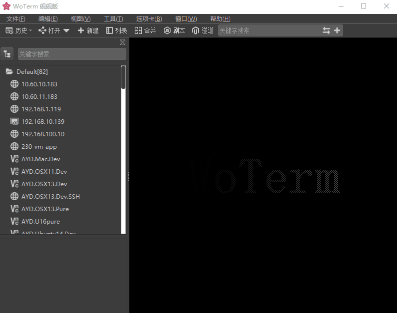

키워드 필터 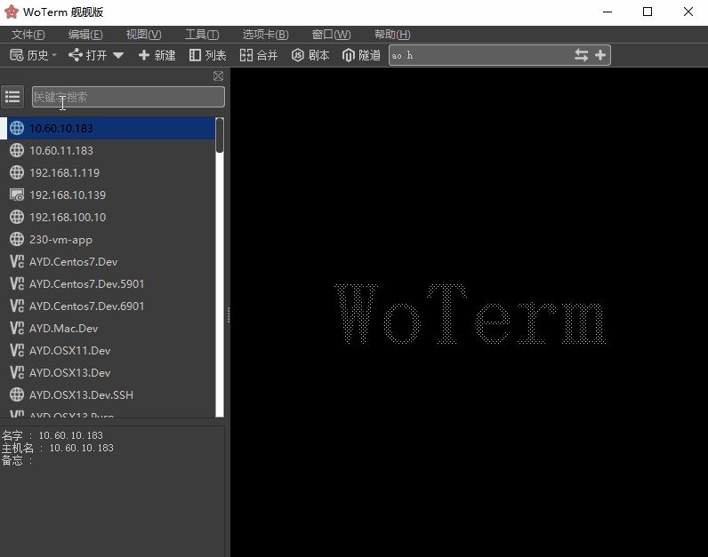

파일 전송 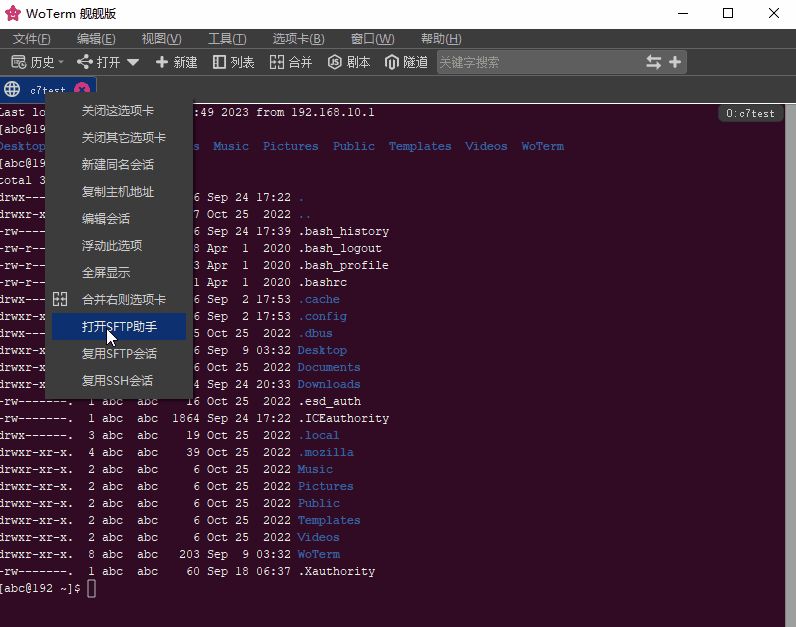

플로팅 탭 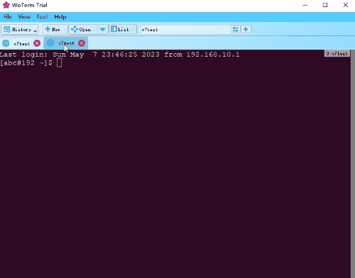

창 분할 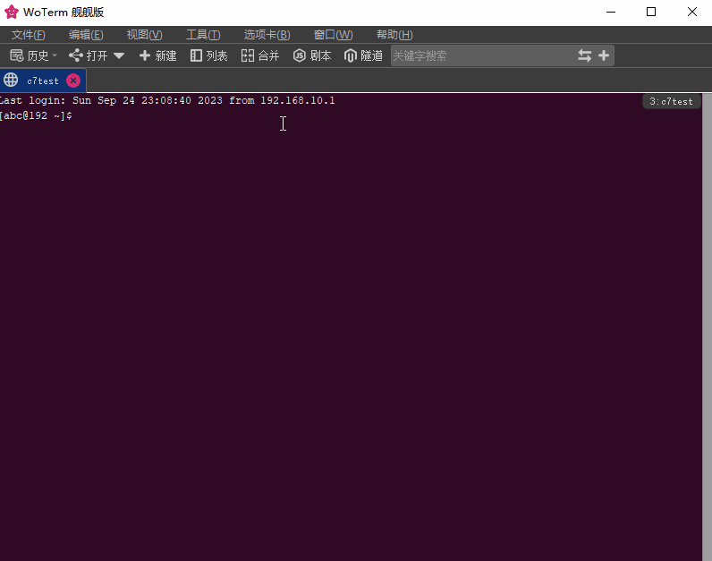

터미널 테마 

VNC 터미널 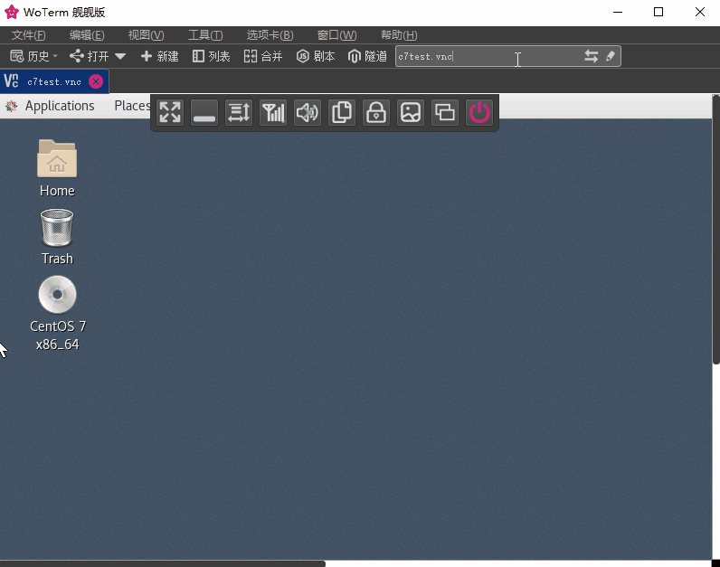

