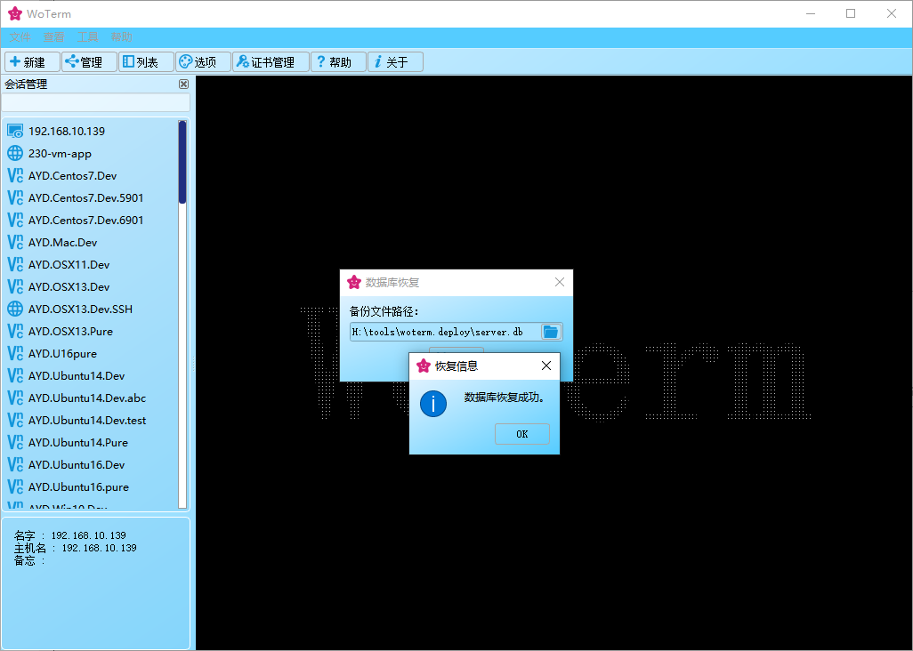
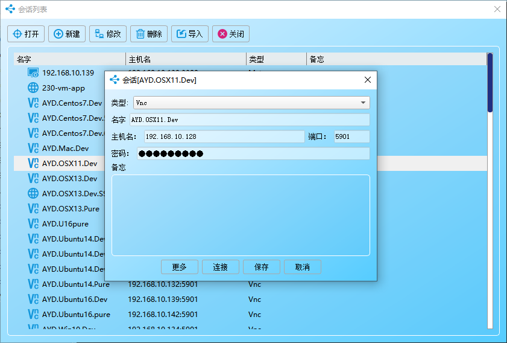
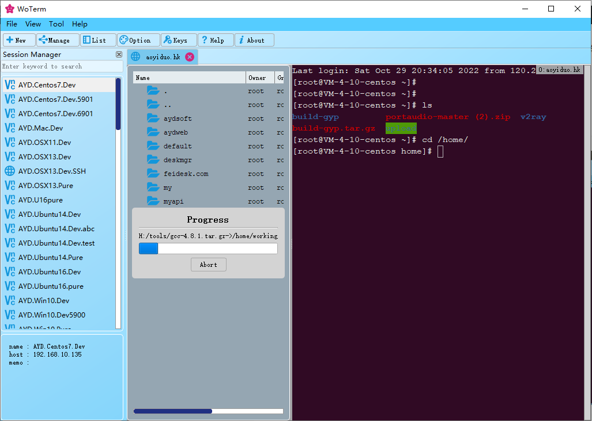
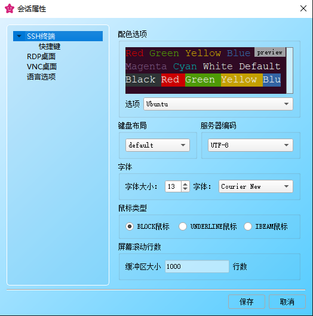
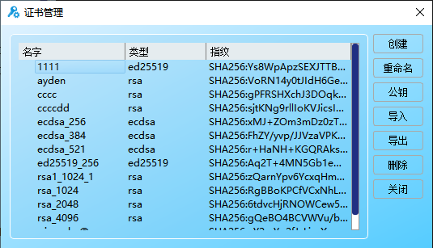

   
  [<a href="README.md">English</a>] | [<a href="README-zh.md">中文</a>]  

# 概要
跨平台远程管理工具，开箱即用，无需配置，安全稳定。

## 功能描述
- 支持Windows / Linux / MacOSX。
- 支持主流的通迅协议，包括SSH1/SSH2/SFTP/RLOGIN/TELNET/SERIALlPORT/VNC/RDP等。
- 采用SQLite保存服务器相关数据，避免多进程下服务器内容变更而相互覆盖。
- 支持数据库备份和恢复以及多端数据同步，防止意外丢失。
- 支持选项卡浮动功能，方便多个窗口协作使用。
- 支持关键字搜索过滤，极速定位目标项。
- 支持中英文语言选择。
  
- 支持VNC远程桌面访问功能，高级功能需要与[WoVNC](http://wovnc.com)服务端才支持。
  - 支持标准的RFB 3.3/3.7/3.8协议。
  - 支持的标准编码有ZRLE/TRLE/Hextile/CopyRect/RRE/Raw。
  - 支持自扩展编码有H264/JPEG/ZRLE3/TRLE3/ZRLE2/TRLE2。
  - 支持自动琐屏。
  - 支持隐私屏。
  - 支持桌面声音回放。
  - 支持无损画质、高清画质、普通画质、经典16位、15位、8位等图像格式的自由切换。
  - 支持多屏模式。
- 支持远程终端访问功能。
  - 支持远程Windown / Linux / MacOSX的系统终端访问。
  - 支持跳板机配置
  - 支持证书管理，包括创建、导入、导出、删除等。
  - 支持快捷键配置。
  - 支持ZModem文件上传下载。
  - 支持嵌入式SFTP协作交互。
  - 支持多种终端配色，任君选择。

## 仓库模块说明
客户端代码已经全部开源，其所依赖的第三方代码均来自GitHub或CodeProject或其它开放社区，部份模块来自[WoVNC](http://wovnc.com)。

## WoVNCServer
推荐使用[WoVNCServer](http://www.wovnc.com)服务端，开启更多高级特性。

## 更多信息: 
<a href="http://www.woterm.com">http://www.woterm.com</a>

## 程序下载:
<a href="http://woterm.com">http://woterm.com</a>

## 界面预览

