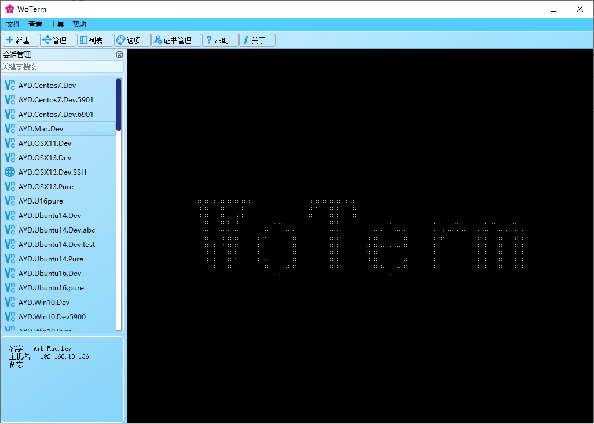
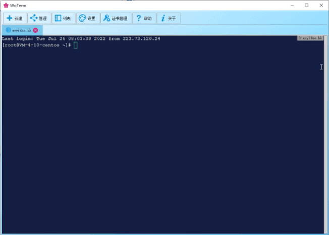
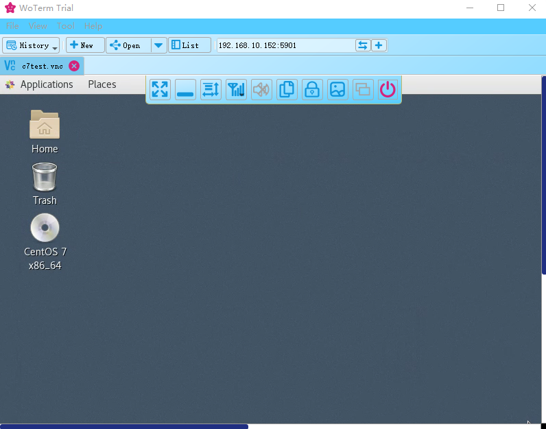
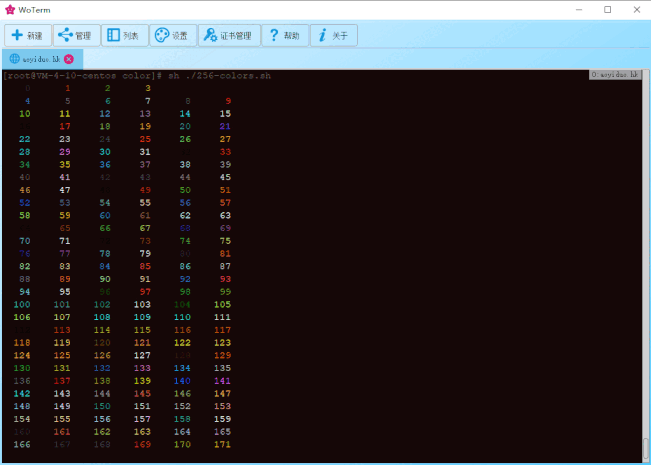

# Overview
A remote shell manager base on Qt 5.

This project is licensed under the terms of the [GPLv3](https://www.gnu.org/licenses/gpl-3.0.en.html) or any later version. See the LICENSE file for the full text of the license.

The main goal of this project is to provide a easy mult-platform tool.

## Feature
- Support SSH1 / SSH2 / Telnet / Rlogin / serialPort / sftp / zmodem / vnc / rdp and more later.
- Support floating tab which makes it more convenient for multiple windows to work together.
- Infinite window segmentation, as long as the screen is large enough, it can be divided as it wants.
- Key word search and filtering, no matter how many records, can also be located at a high speed.
- There are dozens of terminal colors, and there is always a favorite one

## WoVNCServer
It is recommended to use with WoVNCServer to enable more private features

binary program download on [http://www.wovnc.com](http://www.wovnc.com)
## Details: 
<a href="http://www.woterm.com">http://www.woterm.com</a>

## Binary Program:
<a href="http://woterm.com">http://woterm.com</a>

## UI Preview

