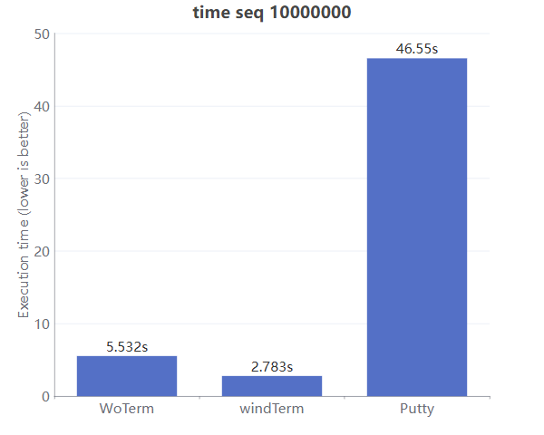
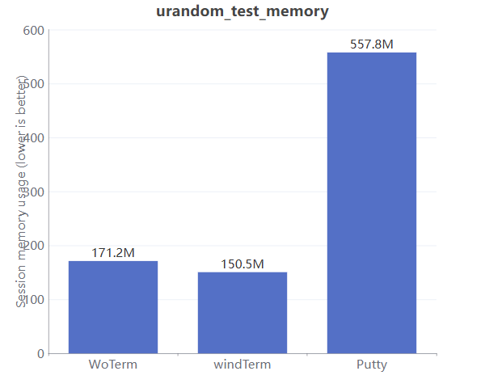
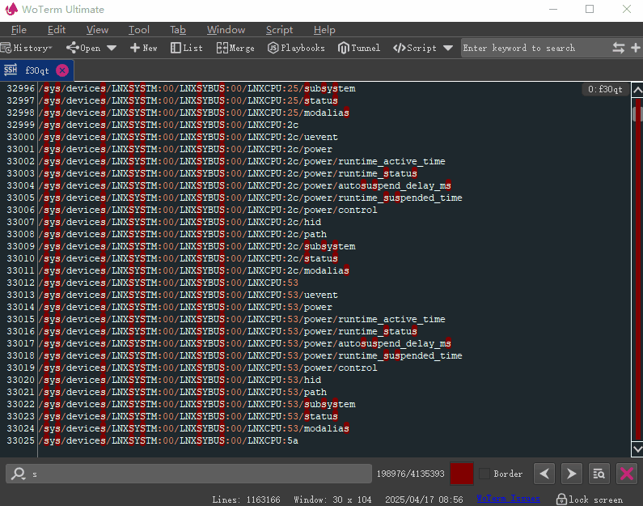
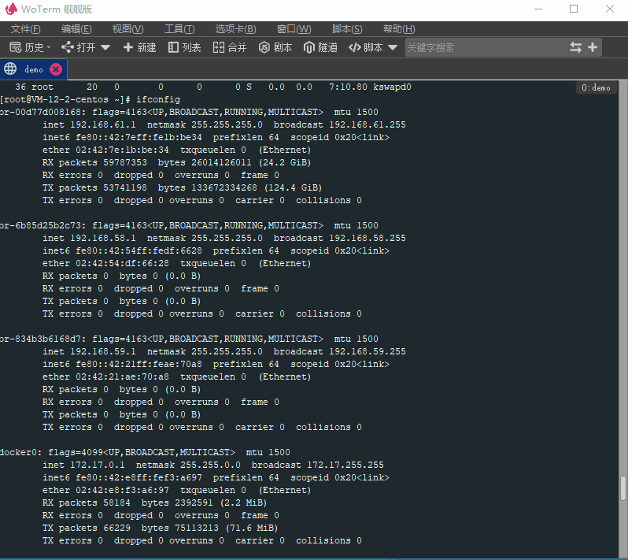

*Ce dépôt ne contient aucune bibliothèque tierce ni code source pour le module kxver.  
Le module kxver est principalement utilisé pour le contrôle de version, notamment pour les fonctionnalités de la version ultime comme le chiffrement des données.  
C'est la seule source de financement de l'équipe et une garantie importante pour la maintenance et la mise à jour du produit.  
Tant que la source de financement n'est pas résolue, il n'y a pas de plan pour ouvrir le code source de ce module.*  
***

  
  <h2 style="text-align: center;">Multi-plateforme / faible mémoire / multi-protocoles / multi-fonctions / synchronisation cloud</h2>
<h3 style="text-align: center;">
  [<a href="../README.md">English</a>] | 
  [<a href="README-zh_CN.md">简体中文</a>]
  [<a href="README-zh_TW.md">繁體中文</a>]
  [<a href="README-de.md">Deutsch</a>]
  [<a href="README-es.md">Español</a>]
  [<a href="README-fr.md">Français</a>]
  [<a href="README-hi.md">हिंदी</a>]
  [<a href="README-id.md">Bahasa Indonesia</a>]
  [<a href="README-ja.md">日本語</a>]
  [<a href="README-ko.md">한국어</a>]
  [<a href="README-ru.md">Русский</a>]
</h3>
  <h3 style="text-align: center;">[<a href="https://woterm.com">Site officiel WoTerm</a>]</a></h3>

# Aperçu
Intégré avec tous les principaux protocoles de communication à distance : prend en charge SSH1/SSH2, FTP/FTPS, SFTP, TELNET, RLOGIN, RDP, VNC, SHELL, port série, TCP, UDP et plus — plus besoin de changer d’outil. Gérez facilement divers scénarios d’accès à distance sur une plateforme unifiée.

## Description des fonctions[<a href="https://en.woterm.com/versions/">&gt;&gt;&gt;Cliquez ici pour voir plus de fonctions&lt;&lt;&lt;</a>]
- Supporte Windows / Linux / MacOSX / Android.  
- Supporte les protocoles de communication principaux : SSH1 / SSH2 / SFTP / RLOGIN / TELNET / SERIALPORT / VNC / RDP, etc.  
- Plusieurs thèmes intégrés et extensibles pour personnalisation.  
- Mode administrateur pour voir les mots de passe des sessions et prévenir le vol.  
- Protocole de synchronisation cloud basé sur SFTP avec 8 algorithmes de chiffrement.  
- Terminal SSH avec assistant SFTP intégré, supporte également les onglets SFTP indépendants.  
- Onglets flottants pour collaboration multi-fenêtres.  
- Segmentation de fenêtres illimitée.  
- Groupement de sessions et filtres de recherche par mots-clés.  
- Des dizaines de couleurs de terminal disponibles.

- Support du bureau à distance VNC, fonctionnalités avancées nécessitent [WoVNCServer](http://wovnc.com).  
  - Support des protocoles RFB 3.3/3.7/3.8.  
  - Support des encodages standards : ZRLE / TRLE / Hextile / CopyRect / RRE / Raw.  
  - Support des encodages étendus : H264 / JPEG / ZRLE3 / TRLE3 / ZRLE2 / TRLE2.  
  - Verrouillage automatique de l’écran en cas de déconnexion ou fin de session.  
  - Mode écran noir à distance.  
  - Lecture sonore du bureau distant.  
  - Changement libre de qualité d’image : sans perte, HD, normale, 16/15/8 bits.  
  - Support multi-écran et modes étiré, écran partagé, écran divisé.  

- Support du terminal distant.  
  - Accès aux terminaux Windows/Linux/MacOSX.  
  - Support Proxy jump.  
  - Gestion des certificats.  
  - Configuration des raccourcis clavier.  
  - Upload/Download fichiers ZModem.  
  - Interaction collaborative SFTP intégrée.  
  - Divers thèmes de terminal.

## Description du module
Le code client est entièrement open source (sauf le module kxver), le code tiers provient de GitHub, CodeProject ou autres communautés ouvertes. Certains modules proviennent de [WoVNC](http://wovnc.com).  

## WoVNCServer
Recommandé [WoVNCServer](http://wovnc.com) pour fonctionnalités avancées.  

## Plus d'informations:
<a href="http://www.woterm.com">http://www.woterm.com</a>  

## Téléchargement des binaires:
<a href="http://woterm.com">http://woterm.com</a>  

## Performances:

Moteur d’analyse de terminal auto-développé, capable d’analyser et d’afficher des dizaines de millions d’enregistrements en quelques secondes tout en maintenant une utilisation mémoire extrêmement faible.<a href="Performance-fr.md">Voir le processus détaillé<a>
 
 
 

Recherche et localisation ultra-rapides dans des millions de lignes de texte 

## Aperçu UI:

Interface principale 

Gestion des clés SSH 

Port série 

Tunnel 

Multiples thèmes 

Playbook 

Fusion et séparation 

Synchronisation cloud 

Filtre par mot-clé 

Transfert de fichiers 

Onglets flottants 

Division de fenêtres 

Thème terminal 

Surlignage de la syntaxe 

Terminal VNC 

