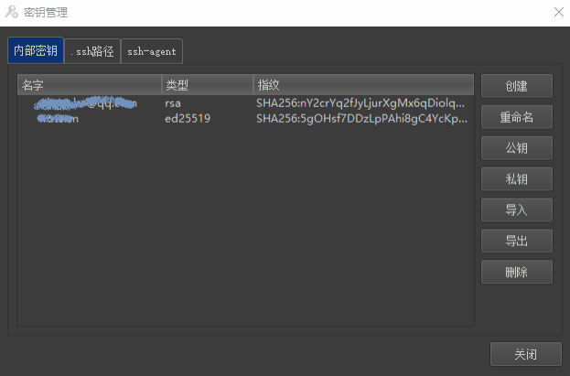

  

<h2 align="center">跨平台 / 小内存 / 多协议 / 多功能 / 云同步</h2>

<h3 align="center">
  [<a href="../README.md">English</a>] | 
  [<a href="README-zh_CN.md">简体中文</a>] |
  [<a href="README-zh_TW.md">繁體中文</a>] |
  [<a href="README-de.md">Deutsch</a>] |
  [<a href="README-es.md">Español</a>] |
  [<a href="README-fr.md">Français</a>] |
  [<a href="README-hi.md">हिंदी</a>] |
  [<a href="README-id.md">Bahasa Indonesia</a>] |
  [<a href="README-ja.md">日本語</a>] |
  [<a href="README-ko.md">한국어</a>] |
  [<a href="README-ru.md">Русский</a>]
</h3>

<h3 align="center">[<a href="https://woterm.com">WoTerm 官网</a>]</h3>

---

# 概要
集成主流远程通讯协议，全面满足您的需求：支持 SSH1/SSH2、FTP/FTPS、SFTP、TELNET、RLOGIN、RDP、VNC、SHELL、串口、TCP、UDP 等多种协议，让您无需切换工具，轻松应对各种远程操作和通讯场景。更多的信息请访问官网。

## 功能描述 [<a href="https://cn.woterm.com/versions/">>>> 点击此处查看更多功能 <<<</a>]
- 支持 Windows / Linux / MacOSX / Android。
- 支持主流的通迅协议，包括 SSH1/SSH2 / SFTP / RLOGIN / TELNET / SERIALPORT / VNC / RDP 等。
- 内置多套皮肤，任君选择，并保留扩展性，让动手能力强的朋友随心所欲。
- 支持管理员模式，可查看会话密码及防止他人盗用等。
- 基于标准 SFTP 构建的云同步协议，让你自由创建云仓库，并提供 8 种高强度加密算法，数据安全尽在掌握中。  
  - 无限制的备份历史及记录的差异化合并、增、删、替换，可满足不同办公环境。  
- SSH 终端内嵌 SFTP 助手，方便协同操作，也支持 SFTP 独立选项卡。
- 浮动选项卡设计，更方便多个窗口间的协同工作。
- 无限的窗口分割，只要屏幕够大，想怎样分割就怎样分割。
- 提供会话分组和列表管理，多种关键字搜索过滤，再多的记录，也能极速定位。
- 数十种终端配色，总有心仪的一款。
- 支持 VNC 远程桌面访问功能，高级功能需要与 [WoVNC](http://wovnc.com) 服务端配合。  
  - 支持标准的 RFB 3.3/3.7/3.8 协议。  
  - 支持的标准编码：ZRLE/TRLE/Hextile/CopyRect/RRE/Raw。  
  - 支持的扩展编码：H264/JPEG/ZRLE3/TRLE3/ZRLE2/TRLE2。  
  - 支持自动锁屏、隐私屏、桌面声音回放。  
  - 支持多种图像质量模式：无损画质、高清、普通、16/15/8 位等。  
  - 支持多屏模式。
- 支持远程终端访问功能。  
  - 支持远程 Windows / Linux / MacOSX 系统终端访问。  
  - 支持跳板机配置。  
  - 支持证书管理（创建 / 导入 / 导出 / 删除）。  
  - 支持快捷键配置。  
  - 支持 ZModem 文件上传下载。  
  - 支持嵌入式 SFTP 协作交互。  
  - 支持多种终端配色方案。

---

## 仓库模块说明
客户端代码已经全部开源（除 **kxver 版本控制模块** 外）。其所依赖的第三方代码均来自 GitHub / CodeProject 或其它开放社区，部分模块来自 [WoVNC](http://wovnc.com)。

---

## WoVNCServer
推荐使用 [WoVNCServer](http://www.wovnc.com) 服务端，以开启更多高级特性。

---

## 更多信息
- 官网：<http://www.woterm.com>  
- 程序下载：<http://woterm.com>  

---

## 性能表现
**自研终端解析引擎**  
  数秒内解析并显千万行记录，并保持极低内存。  
  [查看详细过程](Performance-zh_CN.md)  

    
    
    

**极速搜索定位**  
  在百万行文本中，快速搜索与精确定位。  
  

---

## 界面预览
**主界面**  
  

**SSH 密钥管理**  
  

**串口服务**  
  

**隧道**  
  

**多皮肤**  
  

**剧本**  
  

**选项卡合并及分离**  
  

**云同步**  
  

**关键字搜索**  
  

**SFTP 上传下载**  
  

**选项卡浮动**  
  

**窗口分割**  
  

**终端配色表**  
  

**语法高亮**  
  

**VNC 终端**  
  

---

# 开源声明
自 v10 起，我们对开源协议进行了调整。未来，无论是继续保持部分开源，还是逐步迈向完全开源，我们都会保持开放、透明的态度。  

需要说明的是：本仓库不包含任何第三方库及 **kxver 模块** 的源码或库文件。  
其中 **kxver 模块** 主要用于版本控制，尤其与专业版功能（如数据加密）相关。  
它同时也是团队的唯一资金来源，是产品健康维护和持续升级的重要保障。  
在资金来源问题尚未解决之前，我们暂不计划开放该模块。  

整体上，我们的目标有两个：  
1. **通过适度的商业化获得合理营收** —— 为持续开发与维护提供长期动力；  
2. **保持代码可供用户审计** —— 让大家能够确认软件遵循“不作恶”的原则，放心使用。  

我们希望在坚持初心的同时，也能兼顾可持续发展，让软件既走得稳，也走得远。  
